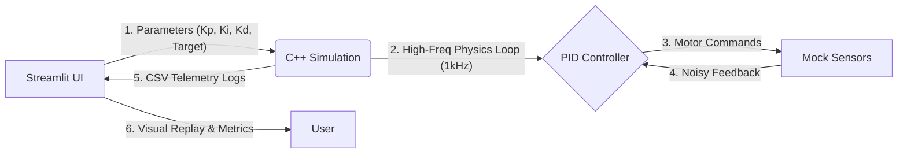

# 🚁 AeroStream: Intelligent Flight Control System


A professional-grade **Flight Control System (FCS)** simulation. This project implements a high-performance C++ PID controller wrapped in a **Streamlit Ground Control Station (GCS)** for real-time telemetry analysis, hardware-in-the-loop (HIL) simulation, and AI-driven parameter optimization.

---

## 🚀 Key Features

### 1. Multi-Mode Flight Simulation
* **Standard Takeoff:** Simulates stable ascent from ground (0m) to target altitude.
* **Step Response:** Simulates mid-flight altitude jumps (e.g., 50m → 100m) to analyze system **agility** and **rise time**.

### 2. Interactive Ground Control Station (GCS)
* **Real-Time Visualization:** Client-side 60FPS rendering of drone flight using **Plotly** & **Streamlit**.
* **Heads-Up Display (HUD):** Dynamic altitude readout attached to the drone telemetry.
* **Replay System:** "DVR-style" flight playback with adjustable speed (Slow-Mo/Real-Time).

### 3. AI Auto-Tuner ("Twiddle" Algorithm)
Automated PID gain optimization using **Coordinate Descent**.
* **🎯 Accuracy Mode:** Optimizes solely for minimal error (RMSE).
* **⚡ Balanced Mode:** Optimizes for a composite cost function: `Cost = RMSE + (Settling Time * Penalty)`. Ensures the drone is both fast *and* accurate.

### 4. Physics Metrics Engine
Automatically calculates and displays critical control theory metrics:
* **Settling Time:** Time to reach and stay within 2% of the target.
* **Overshoot %:** Maximum peak error above target.
* **RMSE:** Root Mean Squared Error (overall tracking accuracy).

---

## 🛠 System Architecture

The system follows a decoupled **"Hardware-in-the-Loop"** architecture:



## 📦 Installation & Usage
### Prerequisites
- **C++ Compiler:** GCC, Clang, or MSVC (supporting C++17).
- **CMake:** Version 3.10+.
- **Python:** Version 3.8+.

### 1. Build the C++ Core
``` Bash
mkdir build && cd build
cmake ..
cmake --build .
```

### 2. Run the Ground Control Station
Navigate to the scripts folder and launch the dashboard:

```Bash
cd ../scripts
pip install -r requirements.txt  # Ensure streamlit, pandas, plotly are installed
streamlit run app.py
```

## 🤖 How the AI Auto-Tuner Works
The project implements a Coordinate Descent (Twiddle) algorithm to find optimal PID gains without human intervention.

1. **Initialization:** Starts with conservative gains `[0.5, 0.0, 0.0]`.
2. **Simulation:** Runs the C++ executable in "Headless Mode".
3. **Cost Calculation:**
   - The Python engine parses the flight logs.
   - Calculates a Cost Score based on the selected strategy (Accuracy vs. Speed).
4. **Gradient Search:** Adjusts parameters ($K_p, K_i, K_d$) incrementally. If the cost decreases, the change is kept; otherwise, it reverses direction. 
5. **Convergence:** Stops when parameter changes no longer yield significant performance improvements.

## 📂 Project Structure
``` Plaintext
├── src/
│   ├── core/           # PID Control Logic (C++)
│   ├── simulation/     # Mock Sensors & Physics (C++)
│   └── main.cpp        # Simulation Entry Point
├── include/            # Header Files & Interfaces
├── scripts/
│   ├── app.py          # Streamlit GCS Dashboard
│   └── visualize.py    # Standalone Plotting Script
├── tests/              # GoogleTest Unit Tests
├── .github/workflows/  # CI/CD Pipeline
├── CMakeLists.txt      # Build Configuration
└── README.md           # Documentation
```

## 📈 Example Results
| Metric | Manual Tuning | AI Optimized (Balanced) |
| :--- | :--- | :--- |
| **Settling Time** | 12.5s | **3.2s** |
| **Overshoot** | 15.0% | **2.1%** |
| **Stability** | Oscillates | **Converged** |

## 📝 License
MIT License. Free to use for educational and portfolio purposes.