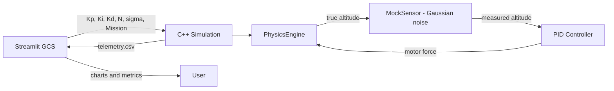

# 🚁 AeroStream: 1D Flight Control Learning Platform

[](https://aerostream.streamlit.app/)


A simulation platform for comparing and benchmarking control strategies on a 1D vertical drone dynamics model. Currently implements a PID controller with filtered derivative action. The `IController` abstract interface makes adding new strategies (bang-bang, LQR, MPC) a matter of implementing a single class.


---

## Architecture


```mermaid
graph LR
    A[Streamlit GCS] -- "Kp, Ki, Kd, N, sigma, Mission" --> B[C++ Simulation]
    B --> C[PhysicsEngine]
    C -- "true altitude" --> D[MockSensor - Gaussian noise]
    D -- "measured altitude" --> E[PID Controller]
    E -- "motor force" --> C
    B -- "telemetry.csv" --> A
    A -- "charts and metrics" --> User
```

### Physics Model

- **Simulation rate:** 10 Hz (dt = 0.1 s), Forward Euler integration
- **Dynamics:** 1D vertical axis — gravity (−9.81 m/s²) + quadratic aerodynamic drag (`0.5 · ρ · v² · Cd · A`)
- **Ground constraint:** position and velocity clamped to 0 on contact
- **Default parameters:** mass = 1 kg, Cd = 0.5, A = 0.1 m²

### Sensor Model

`MockSensor` samples additive Gaussian noise from `std::normal_distribution<double>(0, σ)`.
It is seeded via `std::random_device` by default, or with a fixed seed for reproducible runs
(10th CLI argument). σ defaults to 0.5 m (8th CLI argument); σ = 0 is an ideal sensor.
The controller only sees the measured altitude. The telemetry logs both the true altitude
(`Actual`) and the sensor reading (`Measured`), and all metrics are computed on the true altitude.

### IController Interface

```cpp
// include/IController.hpp
namespace aerostream {
class IController {
public:
    virtual ~IController() = default;
    virtual double calculate(double setpoint, double pv) = 0;
    virtual void reset() = 0;
};
}
```

Any new controller (LQR gain matrix, MPC solver, bang-bang) implements this interface.
`main.cpp` and the test suite operate against `IController*` — no other changes required.

### PID Controller Details

- **Hover thrust feed-forward:** `thrust = m·g + PID(...)`, so the PID only corrects deviations
  from hover. Without it a P-D controller hovers `9.81 / Kp` metres below the target and the
  I term has to carry the entire weight of the drone (can be disabled to demonstrate this).
- **Derivative on measurement** (`-d(pv)/dt`) rather than on error, so setpoint steps cause no derivative kick
- **First-order low-pass filtered derivative:** `α = N·dt / (1 + N·dt)`, default N = 5 rad/s. Lower N filters more noise but adds lag.
- **Anti-windup:** the integral is frozen while the output is saturated, and (optionally) while
  `|error|` is outside an *integral zone* (default 5 m). Without the zone, error accumulated during
  a long climb has to be unwound afterwards as overshoot plus a slow creep back to the setpoint.
- Total thrust clamped to [0, 50] N (drone cannot actively pull downward)
- **Default gains:** Kp = 3.0, Ki = 0.2, Kd = 2.0. A 0 → 100 m takeoff settles within ±2% in about 4 s with under 1% overshoot.

> **Tuning hint:** the plant is (nearly) a double integrator, so a P-only controller oscillates
> forever, and damping comes from the D term. A well-damped response needs roughly
> `Kd ≈ 1–2 × √Kp`.

---

## Getting Started

### Prerequisites

- GCC / Clang (C++17), CMake 3.10+, Python 3.8+

### Build and Test

```bash
mkdir build && cd build
cmake ..
cmake --build .
./unit_tests
```

### Run the Ground Control Station

```bash
cd scripts
pip install -r requirements.txt
streamlit run app.py
```

### Run the Simulation Manually

```bash
cd build
./flight_controller <Kp> <Ki> <Kd> <steps> <target1> <target2> <switch_step> \
                    [noise_sigma=0.5] [filter_N=5] [seed=-1] [hover_ff=1] [i_zone=5]
# Example:
./flight_controller 3.0 0.2 2.0 1000 50.0 100.0 500 0.5
```

- `seed < 0` uses a non-deterministic seed; `seed >= 0` gives a reproducible noise sequence
- `hover_ff = 0` disables the gravity feed-forward
- `i_zone = 0` integrates at all error magnitudes

Output: `telemetry.csv` with columns `Time, Target, Actual (true altitude), Measured (sensor), Velocity, Output (thrust)`.

---

## Features

### Mission Simulation

Two flight profiles:
- **Standard Takeoff** — ascent from 0 m to a target altitude
- **Step Response** — mid-flight altitude jump (e.g., 50 m → 100 m) to characterise rise time and agility

Metrics are computed on the **true** altitude: settling time (±2% of the step), overshoot
(% of the step), RMSE, and thrust chatter (the noise passed on to the motors).
Animated Plotly replay with DVR-style playback, a motor-thrust chart, and CSV export.

### Noise Sensitivity Analysis

The **Noise Analysis** tab flies the current mission and gains at several noise levels σ
(default `0, 0.1, 0.25, 0.5, 1, 2 m`), several times per level with different seeds, and
compares up to three derivative-filter settings N side by side. Seeds are shared across
settings, so differences come from the settings rather than from luck.

For each (N, σ) it reports mean ± std of:
1. **Altitude-hold error**: RMS of the true altitude error over the final 40% of the flight
2. **Thrust chatter**: std of the step-to-step thrust change over the same window
3. **Settling time** (and how many runs settled at all)

A detail view shows true altitude, sensor reading and thrust for any single (σ, N) flight.
This makes the noise/lag trade-off of the D-term filter (and of Kd) directly visible.

### AI Auto-Tuner

Coordinate Descent (Twiddle) optimizes Kp, Ki, Kd automatically, starting from the current gains.
- **Accuracy mode:** minimizes RMSE (true altitude)
- **Balanced mode:** minimizes `RMSE + 0.5 · settling_time + 0.2 · thrust_chatter`

It uses the sidebar's noise σ, filter N, feed-forward and integral-zone settings, with a
fixed noise seed so every evaluation sees the same noise. Convergence criterion:
`sum(dp) < 0.01`, maximum 40 rounds.

---

## Project Structure

```
├── include/
│   ├── IController.hpp     # Abstract controller interface
│   ├── ISensor.hpp         # Abstract sensor interface
│   ├── PID.hpp
│   ├── PhysicsEngine.hpp
│   └── MockSensor.hpp
├── src/
│   ├── main.cpp            # Simulation entry point (7 required + 5 optional CLI args)
│   ├── core/PID.cpp
│   └── simulation/
│       ├── PhysicsEngine.cpp
│       └── MockSensor.cpp
├── tests/
│   ├── test_pid.cpp        # 9 PID tests (incl. derivative kick, integral zone, reset)
│   ├── test_physics.cpp    # 4 physics tests (use setState for clean setup)
│   ├── test_sensor.cpp     # 6 MockSensor tests (noise distribution, setValue, seeding)
│   └── test_closed_loop.cpp # 2 closed-loop tests (PID + physics actually converge)
├── scripts/
│   └── app.py              # Streamlit GCS (Mission Simulation + Noise Analysis tabs)
├── .github/workflows/
│   └── cpp-build.yml       # CI: build+test, clang-tidy lint, ASan/UBSan
└── CMakeLists.txt          # C++17, pinned GoogleTest v1.15.2, clang-tidy, Debug sanitizers
```

---

## CI/CD

Three jobs run on every push and pull request:

| Job | What it checks |
|---|---|
| `build-and-test` | CMake Release build + all 21 unit tests |
| `lint` | clang-tidy (modernize, readability checks) during compilation |
| `sanitizer-tests` | Debug build with AddressSanitizer + UBSan; runs tests under `ASAN_OPTIONS=detect_leaks=1` |

---

## License

MIT License. Free to use for educational and portfolio purposes.
